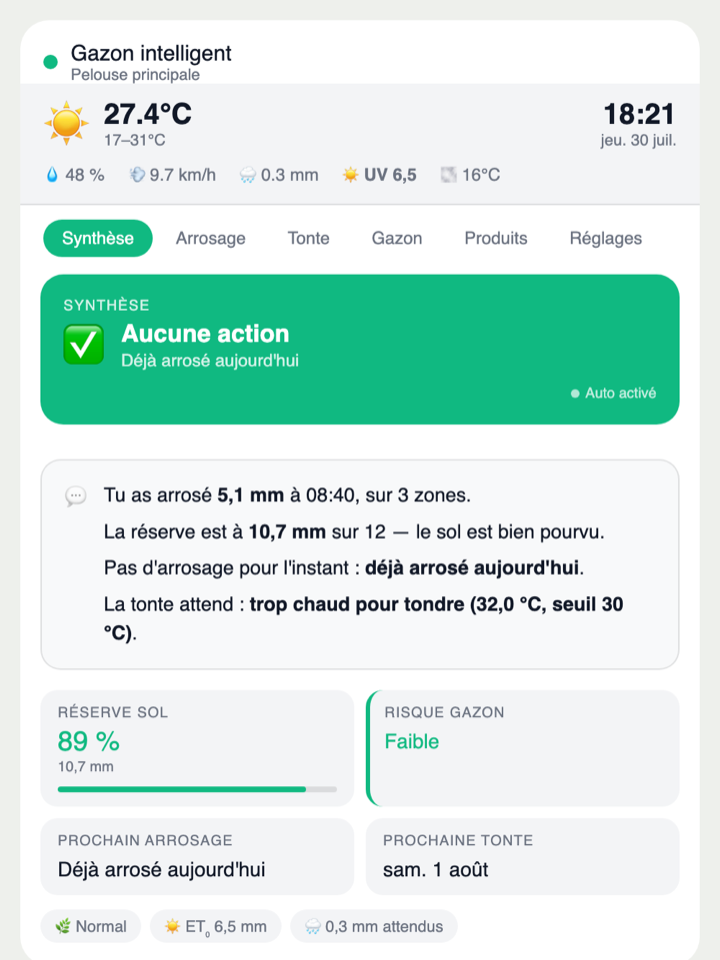
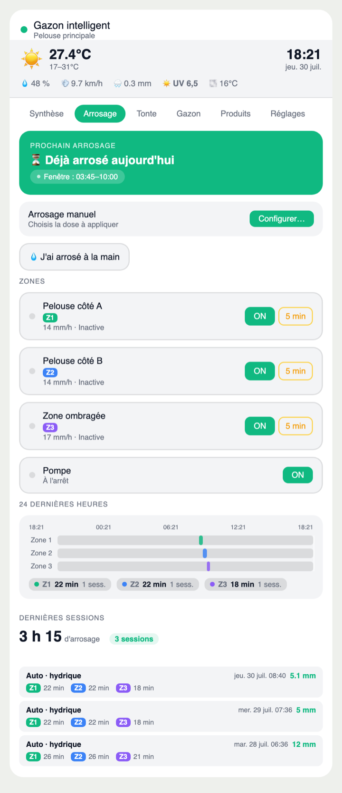
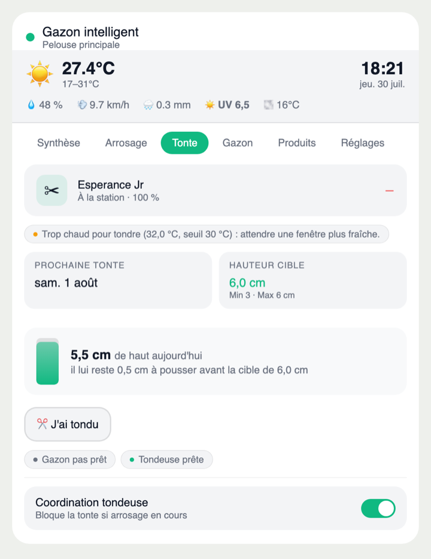
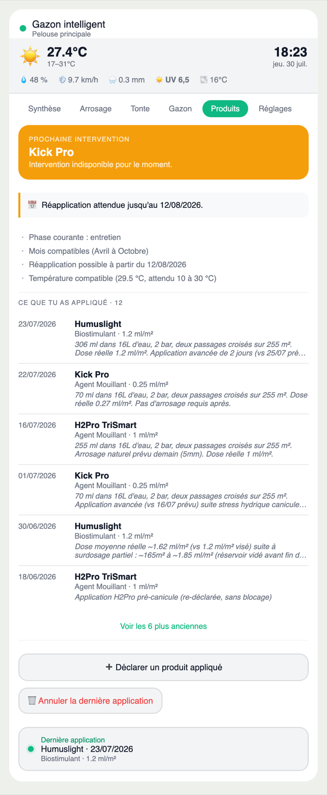
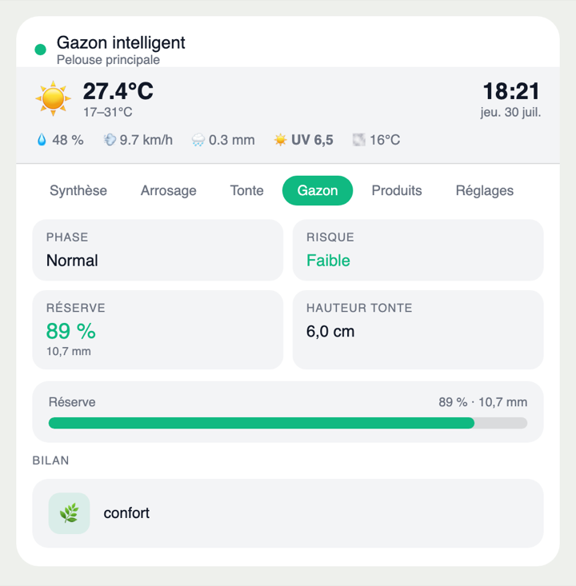
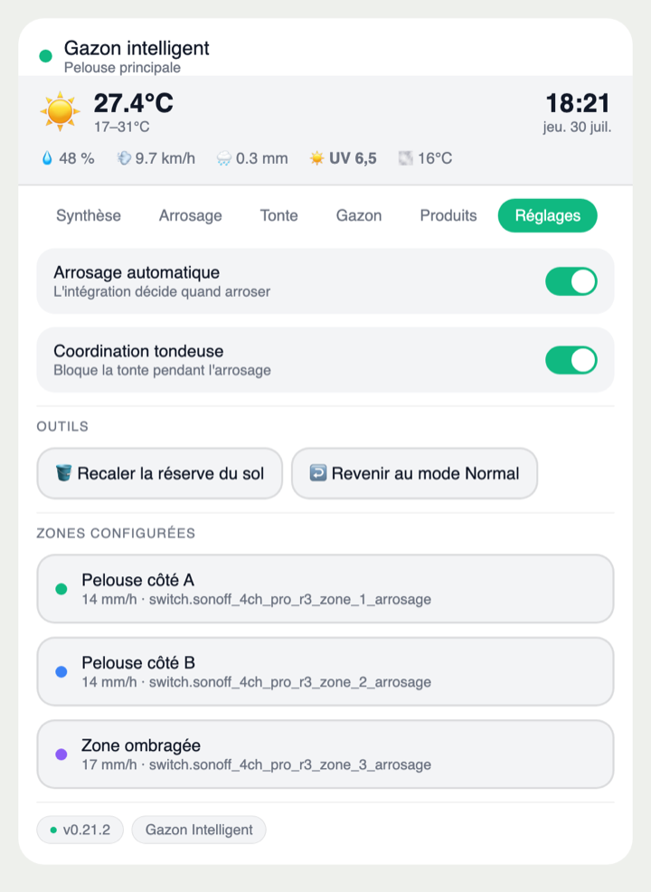
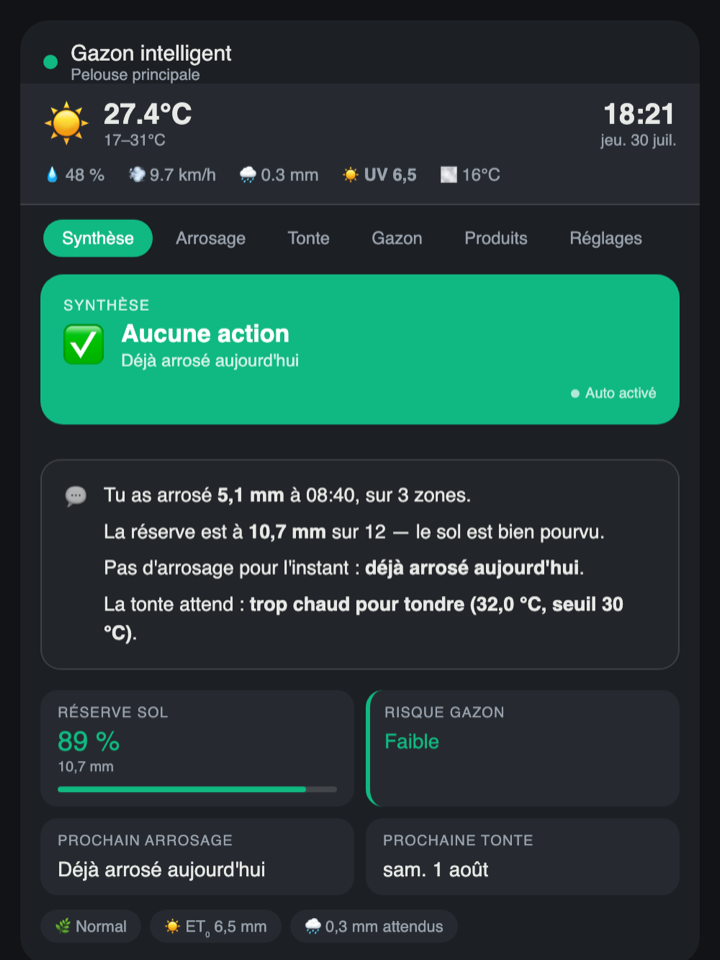

# Gazon Intelligent Card

<p align="center">
  <strong>La carte Lovelace dédiée à l'intégration Home Assistant Gazon Intelligent.</strong><br>
  Un tableau de bord complet pour piloter la tonte, l'arrosage, le gazon et les produits — pensé pour un usage réel.
</p>

<p align="center">
  
  
  
  
</p>

<p align="center">
  
</p>

<p align="center"><em>L'onglet Synthèse : la décision du moment, puis quatre phrases qui l'expliquent.</em></p>

## 🌱 Pourquoi cette card

Cette card n'est pas une carte d'irrigation générique.

Elle a été conçue comme **frontend dédié** de l'intégration [`Gazon Intelligent`](https://github.com/kev21brv10/gazon_intelligent), pour afficher proprement sa façade publique :

- décision du moment (arroser, attendre, tondre)
- prochain arrosage et fenêtre optimale
- prochaine tonte et état de la machine
- réserve hydrique et risque gazon
- produits et interventions
- réglages et coordination tondeuse

## ✨ Ce que la card apporte

- **6 onglets** : Synthèse · Arrosage · Tonte · Gazon · Produits · Réglages
- **Un briefing qui parle** : la Synthèse ne se contente pas d'afficher des valeurs, elle explique
  en quatre phrases ce qui a été arrosé, où en est la réserve, pourquoi rien n'est prévu et ce
  qu'attend la tonte
- **Bandeau météo** : température, min/max, humidité, vent, pluie attendue, UV, point de rosée
- **Frise des 24 h** : barres d'arrosage par zone sur la fenêtre glissante, avec durée et
  nombre de sessions par zone
- **Hauteur de gazon estimée** : jauge du jour et reste à pousser avant la hauteur cible
- **Les services de l'intégration à portée de main**, rangés dans l'onglet où ils servent —
  déclarer un arrosage manuel, une tonte, un produit appliqué, recalibrer la réserve
- **Actions rapides contextuelles** : elles n'apparaissent que lorsqu'elles ont un sens
- **Éditeur visuel natif** : `ha-form` avec sélecteurs d'entités HA (`ha-entity-picker`)
- **i18n FR/EN** : langue détectée automatiquement depuis `hass.locale.language`
- **`getLayoutOptions()`** : support du redimensionnement en mode grille HA
- Support multi-pelouse (plusieurs instances de l'intégration)
- Thèmes clair et sombre natifs HA, téléphone / tablette / ordinateur

## 📸 Les six onglets

| Arrosage | Tonte | Produits |
|---|---|---|
|  |  |  |
| Prochain arrosage et sa fenêtre, zones pilotables une à une, frise des 24 h et journal des sessions. | État de la machine, prochaine tonte, hauteur cible et hauteur estimée du jour. | Prochaine intervention, historique des applications et déclaration en deux clics. |

| Gazon | Réglages | Thème sombre |
|---|---|---|
|  |  |  |
| Phase, risque, réserve du sol et bilan. | Interrupteurs, services de l'intégration et outils de maintenance. | Les deux thèmes Home Assistant sont suivis nativement. |

## 🔗 Dépendance

Cette card dépend de l'intégration :

- [`Gazon Intelligent`](https://github.com/kev21brv10/gazon_intelligent)

Elle attend les entités publiques exposées par `Gazon Intelligent`. Elle n'est pas conçue pour consommer un schéma arbitraire d'autres intégrations d'arrosage.

## 📦 Installation

### Via HACS

1. Ouvre **HACS → Frontend**
2. Ajoute `https://github.com/kev21brv10/lovelace-gazon-intelligent-card` comme dépôt personnalisé
3. Choisis la catégorie **Dashboard card**
4. Installe `Gazon Intelligent Card`
5. Recharge les ressources Lovelace ou redémarre Home Assistant

### Ressource utilisée

```yaml
/hacsfiles/lovelace-gazon-intelligent-card/gazon-intelligent-card.js
```

### Installation manuelle

1. Copie [`gazon-intelligent-card.js`](gazon-intelligent-card.js) dans `config/www/gazon-intelligent-card/`
2. Ajoute la ressource Lovelace :

```yaml
resources:
  - url: /local/gazon-intelligent-card/gazon-intelligent-card.js
    type: module
```

## ✅ Compatibilité

- Home Assistant `2026.1.0+`
- Installation via HACS ou manuelle
- Thèmes clair et sombre
- Dashboards classiques et sections (grid layout)

## 🧩 Exemple minimal

```yaml
type: custom:gazon-intelligent-card
title: Gazon Intelligent
```

Fonctionne si les entités standard de l'intégration sont présentes et suivent la convention de nommage `sensor.gazon_intelligent_*`.

## 🧱 Exemple YAML complet

<details>
<summary>Voir l'exemple complet (toutes les clés de configuration)</summary>

```yaml
type: custom:gazon-intelligent-card
title: Gazon Principal
subtitle: Pelouse principale

# Entités principales
entity_assistant: sensor.gazon_intelligent_assistant
entity_meteo: weather.forecast_maison
entity_arrosage_en_cours: sensor.gazon_intelligent_arrosage_en_cours
entity_prochain_arrosage: sensor.gazon_intelligent_prochain_arrosage
entity_dernier_arrosage: sensor.gazon_intelligent_dernier_arrosage_detecte
entity_prochaine_tonte: sensor.gazon_intelligent_prochaine_tonte
entity_tonte_autorisee: binary_sensor.gazon_intelligent_tonte_autorisee
entity_etat_hydrique: sensor.gazon_intelligent_etat_hydrique
entity_objectif_arrosage: sensor.gazon_intelligent_objectif_d_arrosage
entity_reserve: sensor.gazon_intelligent_reserve_actuelle
entity_risque: sensor.gazon_intelligent_risque_gazon
entity_phase: sensor.gazon_intelligent_phase_dominante
entity_hauteur_conseillee: sensor.gazon_intelligent_hauteur_de_tonte_conseillee
entity_prochaine_intervention: sensor.gazon_intelligent_prochaine_intervention

# Switches
entity_switch_arrosage_auto: switch.gazon_intelligent_arrosage_automatique_autorise
entity_switch_tondeuse: switch.gazon_intelligent_coordination_tondeuse
pompe_switch: switch.pompe_arrosage

# Zones (liste ordonnée)
zones:
  - name: Zone 1
    switch: switch.zone_1_arrosage
    sensor: binary_sensor.zone_1_active
  - name: Zone 2
    switch: switch.zone_2_arrosage
    sensor: binary_sensor.zone_2_active
```

</details>

## ⚙️ Clés de configuration

<details>
<summary>Toutes les clés supportées</summary>

| Clé | Type | Description |
|-----|------|-------------|
| `title` | string | Titre affiché dans l'en-tête de la card |
| `subtitle` | string | Sous-titre optionnel |
| `entity_assistant` | entity | Capteur assistant (action, reason, moment, quantity_mm) |
| `entity_meteo` | entity (weather) | Entité météo pour le widget en-tête |
| `entity_arrosage_en_cours` | entity | Session d'arrosage active |
| `entity_prochain_arrosage` | entity | Prochain arrosage planifié |
| `entity_dernier_arrosage` | entity | Dernier arrosage détecté (avec `derniers_arrosages` pour la timeline) |
| `entity_prochaine_tonte` | entity | Prochaine tonte (avec `target_date`) |
| `entity_tonte_autorisee` | binary_sensor | Tonte autorisée ou non |
| `entity_etat_hydrique` | entity | État hydrique (reserve_available_ratio, reserve_actuelle_mm) |
| `entity_objectif_arrosage` | entity | Objectif d'arrosage (et0_mm, pluie_demain) |
| `entity_reserve` | entity | Réserve sol (fallback si entity_etat_hydrique absent) |
| `entity_risque` | entity | Risque gazon (faible / modéré / élevé / critique) |
| `entity_phase` | entity | Phase dominante du gazon |
| `entity_hauteur_conseillee` | entity | Hauteur de tonte conseillée |
| `entity_prochaine_intervention` | entity | Prochaine intervention produit |
| `entity_hauteur_gazon_estimee` | entity | Hauteur de gazon estimée (jauge de l'onglet Tonte) |
| `entity_derniere_application` | entity | Dernière application produit (produit, date, type, dose) |
| `entity_catalogue_produits` | entity | Catalogue des produits déclarés (popup de déclaration) |
| `entity_fenetre_optimale` | entity | Plafond hebdomadaire (`weekly_guardrail_mm_max`) |
| `entity_switch_arrosage_auto` | switch | Arrosage automatique activé/désactivé |
| `entity_switch_tondeuse` | switch | Coordination tondeuse activée/désactivée |
| `pompe_switch` | switch | Switch pompe (affiché dans l'onglet Arrosage) |
| `zones` | list | Liste des zones avec `name`, `switch`, `sensor` |

</details>

## 🧪 Développement

<details>
<summary>Build, tests et discipline de publication</summary>

```bash
python3 scripts/build.py     # régénère le bundle depuis src/
python3 scripts/validate.py  # contrôles de contrat + garde-fous de syntaxe
```

La CI (`Validate`) rejoue exactement ces deux étapes sur chaque push et PR.

- Toujours rebuilder le bundle après modification des sources
- Publier `bundle + sources ensemble`
- Ne jamais publier seulement `src/` ou seulement le bundle

</details>

## 🚫 Ce que la card ne cherche pas à faire

- Remplacer l'intégration backend
- Inventer une logique métier différente du moteur
- Masquer les incohérences du runtime

Son rôle est d'afficher proprement la façade publique de l'intégration, pas de réécrire ses décisions.

## 📄 Licence

Projet publié sous licence MIT. Voir [`LICENSE`](https://github.com/kev21brv10/lovelace-gazon-intelligent-card/blob/main/LICENSE).
